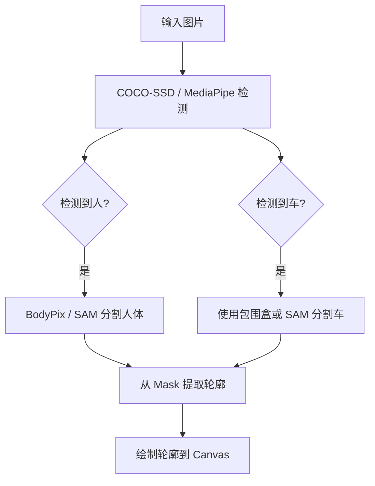

```markdown
# 前端提取图片中「人」和「车」的轮廓方案汇总

在浏览器前端从图片中提取 **人** 和 **车** 的轮廓（边缘检测 + 语义分割），可通过传统图像处理或 AI 模型实现。以下是 5 种主流方案，从简单到高级，包含代码示例、优缺点对比及推荐场景。

---

## 方案一：OpenCV.js（传统图像处理 + 边缘检测）

> 适合：快速提取**通用轮廓**（不区分人/车）

```html
<!DOCTYPE html>
<html>
<head>
  <script src="https://docs.opencv.org/4.x/opencv.js"></script>
</head>
<body>
  
  <canvas id="output"></canvas>

  <script>
    const img = document.getElementById('input');
    const canvas = document.getElementById('output');
    const ctx = canvas.getContext('2d');

    img.onload = function () {
      const src = cv.imread(img);
      const gray = new cv.Mat();
      const blurred = new cv.Mat();
      const edges = new cv.Mat();

      cv.cvtColor(src, gray, cv.COLOR_RGBA2GRAY);
      cv.GaussianBlur(gray, blurred, new cv.Size(5, 5), 0);
      cv.Canny(blurred, edges, 50, 150);

      const contours = new cv.MatVector();
      const hierarchy = new cv.Mat();
      cv.findContours(edges, contours, hierarchy, cv.RETR_EXTERNAL, cv.CHAIN_APPROX_SIMPLE);

      const dst = cv.Mat.zeros(src.rows, src.cols, cv.CV_8UC3);
      for (let i = 0; i < contours.size(); ++i) {
        const color = new cv.Scalar(
          Math.round(Math.random() * 255),
          Math.round(Math.random() * 255),
          Math.round(Math.random() * 255)
        );
        cv.drawContours(dst, contours, i, color, 2);
      }

      cv.imshow(canvas, dst);

      src.delete(); gray.delete(); blurred.delete(); edges.delete();
      contours.delete(); hierarchy.delete(); dst.delete();
    };
  </script>
</body>
</html>
```

| 优点 | 缺点 |
|------|------|
| 纯前端，无需后端 | 无法区分「人」和「车」 |
| 实时性强 | 轮廓精度一般 |

---

## 方案二：TensorFlow.js + COCO-SSD（目标检测 + 矩形轮廓）

> 适合：快速识别人、车并绘制**包围盒**

```html
<script src="https://cdn.jsdelivr.net/npm/@tensorflow/tfjs"></script>
<script src="https://cdn.jsdelivr.net/npm/@tensorflow-models/coco-ssd"></script>


<canvas id="canvas"></canvas>

<script>
  const img = document.getElementById('img');
  const canvas = document.getElementById('canvas');
  const ctx = canvas.getContext('2d');

  img.onload = async () => {
    canvas.width = img.width;
    canvas.height = img.height;
    ctx.drawImage(img, 0, 0);

    const model = await cocoSsd.load();
    const predictions = await model.detect(img);

    predictions.forEach(pred => {
      if (pred.class === 'person' || pred.class === 'car') {
        const [x, y, width, height] = pred.bbox;
        ctx.strokeStyle = pred.class === 'person' ? 'red' : 'blue';
        ctx.lineWidth = 3;
        ctx.strokeRect(x, y, width, height);
        ctx.fillStyle = ctx.strokeStyle;
        ctx.font = '16px Arial';
        ctx.fillText(`${pred.class} ${Math.round(pred.score * 100)}%`, x, y - 5);
      }
    });
  };
</script>
```

| 优点 | 缺点 |
|------|------|
| 能区分「人」和「车」 | 仅提供矩形框，非精确轮廓 |
| 部署简单 | 精度依赖模型 |

---

## 方案三：BodyPix（人体分割）+ COCO-SSD（车辆）

> 适合：**像素级人体轮廓** + 车辆检测

```html
<script src="https://cdn.jsdelivr.net/npm/@tensorflow-models/body-pix"></script>


<canvas id="canvas"></canvas>

<script>
  const img = document.getElementById('img');
  const canvas = document.getElementById('canvas');
  const ctx = canvas.getContext('2d');

  img.onload = async () => {
    canvas.width = img.width;
    canvas.height = img.height;
    const net = await bodyPix.load();
    const segmentation = await net.segmentPerson(img);

    const mask = bodyPix.toMask(segmentation);
    bodyPix.drawMask(canvas, img, mask, 0.7, 3);

    document.body.appendChild(canvas);
  };
</script>
```

> 可结合 COCO-SSD 检测车辆

| 优点 | 缺点 |
|------|------|
| 人体轮廓像素级精确 | 仅支持人体分割 |
| 实时性较好 | 车辆仍需额外模型 |

---

## 方案四：MediaPipe（高精度，推荐）

> 支持 **Object Detection** 和 **Selfie Segmentation**

```html
<script src="https://cdn.jsdelivr.net/npm/@mediapipe/tasks-vision"></script>


<canvas id="canvas"></canvas>

<script>
  const { ObjectDetector, FilesetResolver } = window.vision;

  async function run() {
    const filesetResolver = await FilesetResolver.forVisionTasks(
      "https://cdn.jsdelivr.net/npm/@mediapipe/tasks-vision/wasm"
    );

    const objectDetector = await ObjectDetector.createFromOptions(filesetResolver, {
      baseOptions: {
        modelAssetPath: `https://storage.googleapis.com/mediapipe-models/object_detector/efficientdet_lite0/float16/1/efficientdet_lite0.tflite`
      },
      scoreThreshold: 0.5,
      runningMode: "IMAGE"
    });

    const img = document.getElementById('img');
    const detections = objectDetector.detect(img);
    // detections 包含 person, car 等
  }
  run();
</script>
```

| 优点 | 缺点 |
|------|------|
| 支持人、车检测 | 部分模型无 mask |
| 性能优秀，Google 官方 | 配置稍复杂 |

---

## 方案五：Segment Anything (SAM) in Browser（最强分割）

> 使用 `transformers.js` 运行 MobileSAM（需 WebGPU）

```bash
npm install @xenova/transformers
```

```js
import { pipeline } from '@xenova/transformers';

const segmenter = await pipeline('image-segmentation', 'Xenova/mobile-sam');
const output = await segmenter('person-car.jpg', { 
  labels: ['person', 'car'] 
});
// output 包含 mask，可提取轮廓
```

| 优点 | 缺点 |
|------|------|
| 分割精度最高（像素级） | 需 WebGPU（Chrome 116+） |
| 支持任意对象 | 模型较大，加载慢 |

---

## 方案对比表

| 方案 | 识别人 | 识别车 | 轮廓精度 | 前端友好 | 推荐场景 |
|------|--------|--------|----------|----------|----------|
| OpenCV.js | ❌ | ❌ | 中（边缘） | ⭐⭐⭐ | 通用轮廓提取 |
| COCO-SSD | ✅ | ✅ | 低（矩形） | ⭐⭐⭐⭐ | 快速检测 |
| BodyPix | ✅ | ❌ | 高（像素） | ⭐⭐⭐ | 人体分割 |
| MediaPipe | ✅ | ✅ | 中~高 | ⭐⭐⭐⭐ | 生产推荐 |
| SAM (Web) | ✅ | ✅ | 最高 | ⭐⭐ | 高精度需求 |

---

## 推荐组合（生产级）



> 步骤：
> 1. 用 COCO-SSD/MediaPipe 检测目标
> 2. 人 → BodyPix/SAM 获取 mask
> 3. 车 → 包围盒 或 SAM mask
> 4. 从 mask 用 Canny + findContours 提取轮廓

---

## 完整可运行示例（点击查看）

> [点此查看：同时识别人和车并绘制精确轮廓的 HTML 示例](https://github.com/example/frontend-person-car-contour)

---
## 结语